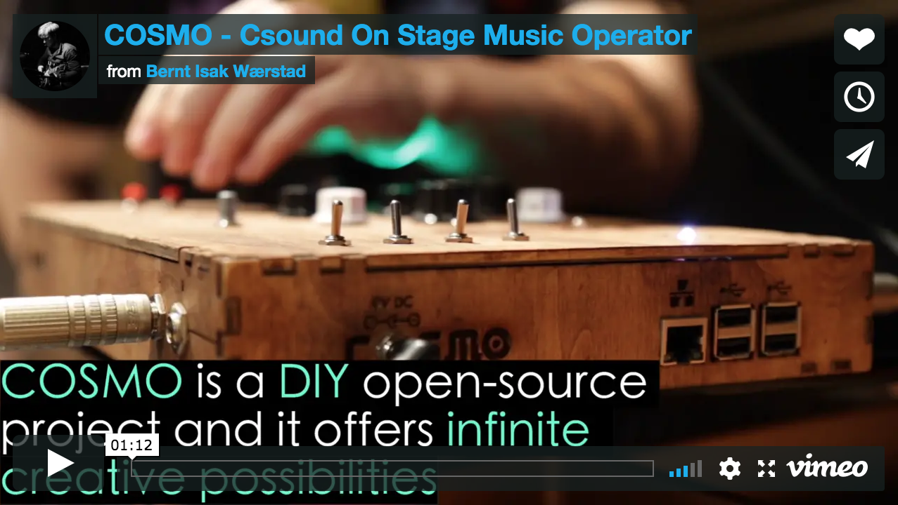

# Csound and Bela: touching opcodes

## What is Csound?

[Csound](https://csound.com/) is an audio software and programming language for sound synthesis and composition. It was developed by Barry Vercoe at MIT Media Lab in 1986, but its roots go all the way back to the Music III Software developed by Max Matthews in 1961. 

Today Csound is developed by a group of core developers with a wider community of volunteers contributing. One of the main principles in Csound development is to guarantee backwards compatibility. You can still run Csound source files from 1986 on the latest Csound release.

Although Csound has a strong tradition as a tool for composing electro-acoustic pieces and traditionally has been used in a non-interactive score driven context, nowadays it is mostly used in a real-time context. Csound can run on various different hardware and software platforms including all major operating systems as well as Android and iOS. Csound can also be called through other programming languages such as Python, Lua, C/C++, Java, etc. and is now also supported on the [Bela](https://bela.io/) platform!


## Writing a Csound instrument
Csound documents are simple text documents starting with the XML type tag ```<CsoundSynthesizer>``` and are then structured into 3 sections:  ```<CsOptions>```, ```<CsInstruments>``` and ```<CsScore>```

```
<CsoundSynthesizer>

<CsOptions>
</CsOptions>

<CsInstruments>
</CsInstruments>  

<CsScore>
</CsScore>

</CsoundSynthesizer>
```

Each section of Csound code has its on [syntax and grammar](https://csound.com/get-started.html). The first couple of lines in ```<CsOptions>``` are mainly some [hardware/software settings](https://csound.com/docs/manual/Using.html), which for now we can ignore.

Where the fun starts is in the ```<CsInstruments>``` section with defining instruments (or setting up patches). An new instrument is defined between the ```instr``` and ```endin``` lines (see example below). Instruments are built by combining signal processing modules which are called *opcodes* in Csound. There are [thousands of opcodes](https://csound.com/docs/manual/PartOpcodesOverview.html) available for different kinds of oscillators, filters, envelopes, delays, reverbs, sample manipulation tools and so on. The [Csound Reference Manual](https://csound.com/docs/manual/PartReference.html) provides more information and examples for each available opcode.


Here we will start right into writing a first simple instrument which uses a [*pink noise*](https://csound.com/docs/manual/pinker.html) generator, a [simple sine oscillator](https://csound.com/docs/manual/oscils.html), two [LFOs](https://csound.com/docs/manual/lfo.html) and an opcode for [stereo panning](https://csound.com/docs/manual/pan2.html). The output of an opcode is assigned to a variable e.g. ```aNoise``` is the holder for the audio signal generated by the ```pinker``` opcode. Here, Csound has specific [variable types](http://www.csounds.com/journal/issue10/CsoundRates.html) for the data to hold. The first letter of a variable name sets the type, in this case aNoise expects an a-rate (audio) signal. Other types you will often find are k-rate (control rate) signals, that are updated less frequently to save computing power and i-rate signals which can only be set once, when the instrument is instantiated.

In the CsScore section instruments can be called by their name or number. In this case ```instr 1``` is called 4 times with different settings for p4 and p5. This is the most straight forward way to run instruments, although other options like triggering by [MIDI events](http://write.flossmanuals.net/csound/b-triggering-instrument-instances/) and triggering [live-events](http://write.flossmanuals.net/csound/f-live-events/) from within other instruments is worth to check out.


```
<CsoundSynthesizer>

<CsOptions>
-odac -iadc
</CsOptions>

<CsInstruments>

sr = 44100
ksmps = 8
nchnls = 2
0dbfs = 1.0

instr 1
  aNoise pinker                 ; pink noise
  aSin poscil 0.4, p4           ; sine oscillator
  aLFO1 lfo 0.7, p5, 3          ; LFO - square (unipolar)
  aLFO2 lfo 0.7, .3, 2          ; LFO - square (bipolar)
  aSig = (aLFO1 * aNoise) + (aLFO2 * aSin)  ; crazy mixing
  aSigL, aSigR pan2 aSig, aLFO1-aLFO2       ; insane panning
  outs aSigL, aSigR             ; stereo output
endin

</CsInstruments>

<CsScore>
;Ins St Dur sinFq lfoFq
  i1 0  2    250    2
  i1 +  2     50   10
  i1 +  2   1500   .5
  i1 +  1     50   10
</CsScore>

</CsoundSynthesizer>
```

## Csound and Bela

The idea to run Csound on the Bela Board came from the [COSMO-project](http://cosmoproject.github.io/) (Csound On Stage: Music Operator), which is a project devoted to making hardware- and software frameworks for making embedded standalone Csound instruments to use on stage. The COSMO team originally worked with Raspberry-Pi's but that always required some custom hardware, for better sound quality, adequate latency, and individual controller inputs. All these hardware requirements are already met by the Bela boards, so it was only a matter to bring Csound onto the Bela platform.
A small team, namely [Bernt Isak Wærstad](http://berntisak.no), [Victor Lazzarini](https://github.com/vlazzarini) and [Alex Hofmann](https://homepage.univie.ac.at/alex.hofmann/) started to work on this project in Autumn 2017 and a first release of BelaCsound was pubished in July 2018.

<p align="center">

[](https://vimeo.com/183101272 "COSMO - Csound On Stage Music Operator")
[COSMO - Csound On Stage Music Operator](https://vimeo.com/183101272)

</p>


### Getting started

Bela comes with a very nice browser based IDE (see [https://github.com/BelaPlatform/Bela/wiki/Getting-started-with-Bela](https://github.com/BelaPlatform/Bela/wiki/Getting-started-with-Bela) for an introduction on how to install necessary drivers and accessing the IDE) which makes developing and setting up a Bela with Csound extremely easy. With the [IDE](https://github.com/BelaPlatform/Bela/wiki/Bela-IDE) opened, you simply click "Create new project", select ```Csound``` as project type and type in your desired name for the project. This will automatically create a default example project which introduces some key concepts like how to read in values from the analog pins and how to turn an LED on and off. Other and more advanced concepts can be explored in the Examples section under ```Csound```

### Bela inputs and outputs in Csound

To communicate with the analog channels on the Bela, we're using the Csound channel system. The input channels are named ```analogIn0``` to ```analogIn7``` and output channels ```analogOut0``` to ```analogOut7```. To read values, we use the [chnget](https://csound.com/docs/manual/chnget.html) opcode and [chnset](https://csound.com/docs/manual/chnset.html) is used to write values. Note that these are a-rate channels, so a downsampling is needed if you want to use the input values as k-rate control signals 

	;------------------------------------------------------
	;  	Simple AM synth with analoge in and out
	;------------------------------------------------------

	instr 1

		; Analog in 0 controls carrier frequency
		aCarFreq chnget "analogIn0"
		aCarFreq = (aCarFreq * 1000) + 50
		kCarFreq = k(aCarFreq) ; downsampling from a-rate to k-rate

		; Analog in 1 controls modulator frequency
		aModFreq chnget "analogIn1"
		aModFreq *= 100
		kModFreq = k(aModFreq)

		; Analog in 2 controls modulator amount
		aAM_vol init 1
		aAM_vol chnget "analogIn2"
		

		; Modulator
		aMod oscil aAM_vol*0.5, kModFreq
		aMod += 0.5

		; Carrier with envelope
		kEnv adsr 0.1, 0, 0.8, 0.3
		aCar poscil 0.8*kEnv, kCarFreq
		aOut = aCar * aMod

		; Set LED to blink in time
		; with modulation frequency
		
		chnset aMod, "analogOut0"

		outs aOut, aOut
		
	endin

#### Building a simple effect processor using the COSMO dsp-library

The [cosmo-dsp repository](http://github.com/cosmoproject/cosmo-dsp) comprises a library of ready-made audio effects (e.g Reverb, Delay, Distortion, Filters etc.). All effects are set up as independendant modules that can be combined to a custom setup of effects. To make it as much plug and play as possible, all arguments are also normalized (0-1) and scaled properly inside the effect so that the user can use them immediately.

To use one of the readymade effects, you first need to download the file containing the desired effect, place it with your csd file and include it using ```#include``` like this:

	#include "Reverb.udo"

The name and a quick explanation of the arguments can be found in the header of each ```.udo``` file in the COSMO dsp-library (e.g. [```Reverb.udo``` ](https://github.com/cosmoproject/cosmo-dsp/blob/master/DSP-Library/Effects/Reverb.udo)). Since all arguments are normalized, we can directly use the analogIn values to control the paramters of the effect. Here is a complete example of a Reverb effect where the dry/wet mix is controlled by a potentiometer connected to the first analog in of the Bela-board.

	<CsoundSynthesizer>
	<CsOptions>
	-m0d
	</CsOptions>
	<CsInstruments>
	ksmps  	= 16
	0dbfs	= 1
	nchnls 	= 2

	#include "../DSP-Library/Effects/Reverb.udo"

	instr 1 
		aL, aR ins

		aPot0 chnget "analogIn0"
		kMix = k(aPot0)

		; Reverb arguments: decay, cutoff, mix
		aL, aR Reverb aL, aR, 0.9, 0.5, kMix 

		outs aL, aR
	endin


	</CsInstruments>
	<CsScore>
	i1 0 86400
	</CsScore>
	</CsoundSynthesizer>


The same approach applies to any of the other effects found at [https://github.com/cosmoproject/cosmo-dsp/tree/master/DSP-Library/Effects](https://github.com/cosmoproject/cosmo-dsp/tree/master/DSP-Library/Effects) and you can combine them in any order.

#### Building a MIDI controlled synthesizer

One thing where Csound, arguably, outperforms other environments is how quick you can write a MIDI synthesizer. This comes in very handy in combination with Bela, as you can connect any class-compliant MIDI-keyboard to the USB-port of Bela, load a Csound instrument and play it like a synth.

In ```<CsOptions>```, you can select the MIDI-device you'd like to control Csound with. As a default, the MIDI channel defines the instrument number which is called for each pressed key, this could be changed by setting [massign](https://csound.com/docs/manual/massign.html).
To avoid cpu overload by triggering too many voices in parallel, the [maxalloc](https://csound.com/docs/manual/maxalloc.html) option allows to restrict the maximum number of voices (in this example set to 4 voices).

```
<CsoundSynthesizer>
<CsOptions>
-Mhw:1,0,0 -+rtmidi=NULL --daemon
</CsOptions>
<CsInstruments>

; Initialize global variables.
sr = 44100
ksmps = 8
nchnls = 2
0dbfs = 1

seed 0 ; init random function
maxalloc 1, 4 ; restrict to maximum 4 voices

;------------------------------------------------------
; Instrument will be played by MIDI notes on Channel 1
;------------------------------------------------------
instr 1
	iFreq cpsmidi
	iAmp ampmidi 0.3

	; Three detuned sawtooth oscillators
	aOut1 = vco2(iAmp, iFreq)
	aOut2 = vco2(iAmp, iFreq*1.004)
	aOut3 = vco2(iAmp, iFreq*0.995)

	; Envelope
	aOut = aOut1 + aOut2*0.5 + aOut3*0.5
	aEnv linsegr 0, 0.01, 0.1, 0.2, 0

	; Filter LFO and envelope
	kLFO = lfo(50, 1.2, 0)
	aFiltEnv linsegr 100, 1.2, 1000, 0.2, 0

	; Korg35 resonant low-pass filter
	aOut = K35_lpf(aOut, aFiltEnv+kLFO, 9.4, 0, 1)

	; Voice panning
	iPan random 0.2, 0.8;
	aOutL, aOutR pan2 aOut, iPan

	; Output
	outs aOutL*aEnv, aOutR*aEnv
endin


</CsInstruments>
<CsScore>
</CsScore>
</CsoundSynthesizer>
```

### Good programming practices for Bela

 In a real-time audio system like Bela, accessing other hardware than the audio device (eg. printing to console, reading writing to harddisk etc..) should be avoided (although it is sometimes required during debugging). In Csound printing and other console messages can be suppressed by adding ```-m0d``` to the ```<CsOptions>``` section. Loading files from disk should also be avoided (for instance loading audio files with ```diskin2```), but should rather be loaded into memory with function table generators. Using ```reinit``` to re-initialize i-rate variables should also be avoided if possible as it can cause a mode switch which normally leads to a drop-out. 

#### Projects made with Csound and Bela 

##### Augmented Tenor-Saxophone (COSMO)
Based on the effects collection in the COSMO library, [Alex](https://homepage.univie.ac.at/alex.hofmann/) built a Tenor-Saxophone with integrated live-electronics. Inside the bell of the instrument he mounted a Bela board, with speaker and microphone, all powered by a regular 5V-phone charger power-bank. On the Bela board, a Csound-Patch is running that processes his playing in realtime, either by adding modulation effects or by live-sampling and playback. 

The structure of the saxophone part of the 12 minute performance was chosen by an algorithm, which randlomly picks voice samples with instructions out of three categories (tempo, dynamics, tonal material). Verbal instructions such as "Fast, loud, three tones!" give cues to the player but are also hearabel for the audience. Furthermore, this setup allows the performer to move freely on stage or even walk into the audience, as all live-electronic parts are inside the saxophone. A full version of a 12 minute performance with this augmented Tenor-Saxophone at the Linux Audio Conference 2018 can be found [here](https://homepage.univie.ac.at/alex.hofmann/general/2018/10/29/LAC2018_VID.html).

Embedd either Video:

<iframe width="560" height="315" src="https://www.youtube.com/embed/C_6mvbx8esQ" frameborder="0" allow="accelerometer; autoplay; encrypted-media; gyroscope; picture-in-picture" allowfullscreen></iframe>


This video shows short summary of a performance with the augmented Tenor-Saxophone at the Linux Audio Conference 2018.


..or Image:


https://homepage.univie.ac.at/alex.hofmann/myprojects/pics/cosmo/sax_cosmo.jpg


This figure shows an augmented Tenor-Saxophone setup, with Bela running Csound, an active speaker, a microphone and a 5V power-bank mounted inside the bell of the instrument.


##### Electroacoustic guitar (COSMO)

##### Sound platforms for Oslo Philaharmonic kid's day

##### Syngebela (wireless COSMO)


